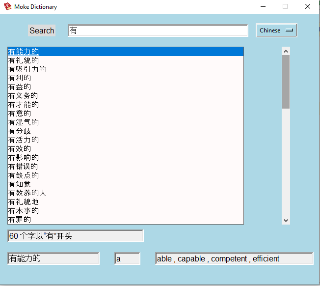
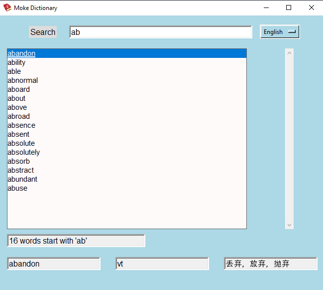
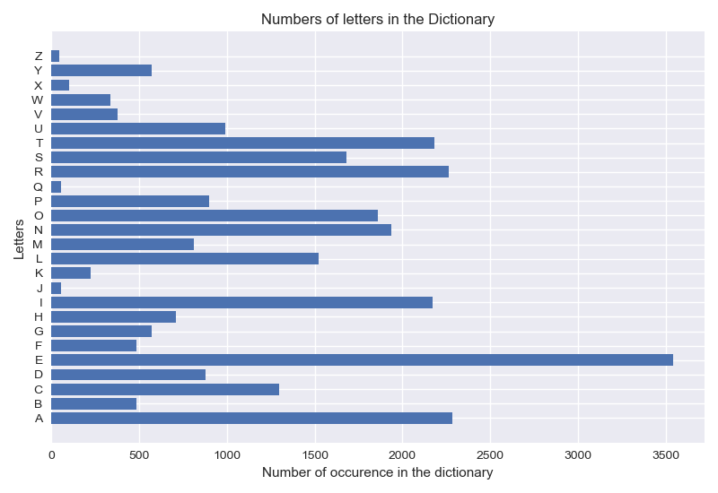

--------------------------------------------------

".Folder" contains image of my dictionary icon and the datasets. 
	* I changed text file to csv file to finish my project. so, the file is in csv format.  

To install the requirements 
```pip install -r requirement.txt```

To start the dictionary run ```main.py```

The dictionary looks like this: 

### General Layout:
On the right corner you can change the language to English.



### Searching
While searching for specific word the dictionary looks like this. 



### The first letter distribution

 
		THANK YOU! 

--------------------------------------------------
